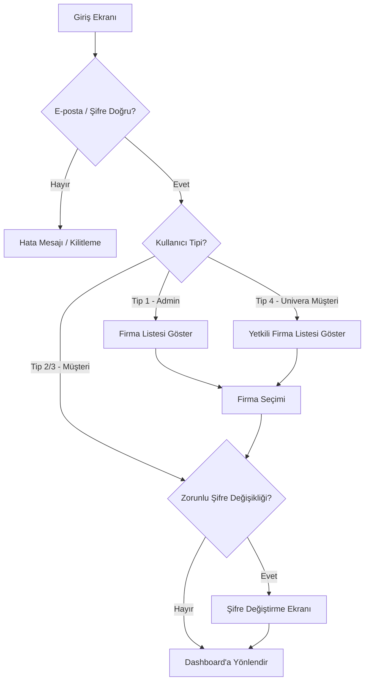
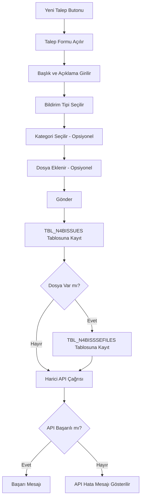
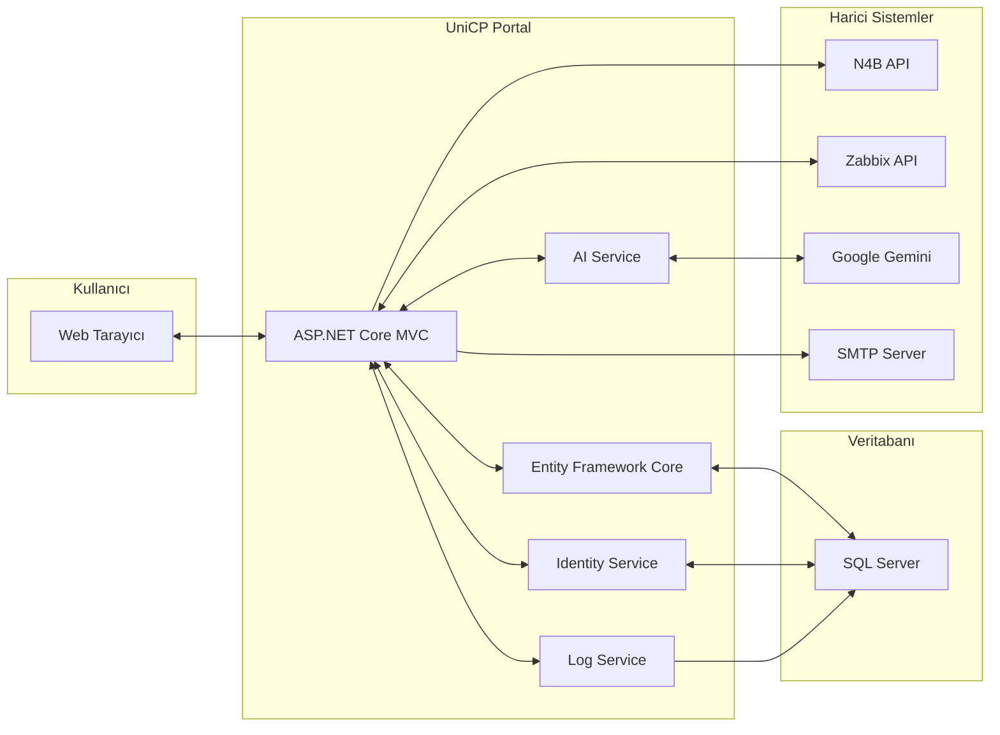

# Univera Connect Portal — Proje Tanım Dokümanı

**Proje Adı:** Univera Connect Portal (UniCP)
**Versiyon:** 1.0
**Tarih:** 23 Şubat 2026
**Hazırlayan:** Proje Geliştirme Ekibi

---

## 1. Projenin Amacı ve Kapsamı

Univera Connect Portal, **Univera'nın müşterilerine sunduğu merkezi bir B2B müşteri yönetim platformudur.** Portal, müşteri firmaların destek taleplerini, finansal işlemlerini, lisans sözleşmelerini, sistem performans verilerini ve raporlarını tek bir noktadan takip edebilmesini sağlar.

### 1.1 İş Hedefleri

| Hedef | Açıklama |
|-------|----------|
| **Merkezi Yönetim** | Tüm müşteri etkileşimlerini tek platformda toplamak |
| **Self-Servis** | Müşterilere kendi verilerine erişim ve talep yönetimi imkânı |
| **Şeffaflık** | Finansal durum, talep durumu ve sistem performansının anlık takibi |
| **Verimlilik** | Rapor oluşturma, mutabakat ve iletişim süreçlerini dijitalleştirme |
| **Yapay Zekâ Desteği** | Müşteri verilerine dayalı akıllı asistan ile hızlı bilgi erişimi |

---

## 2. Kullanıcı Tipleri ve Yetkilendirme

### 2.1 Kullanıcı Tipleri

Sistemde dört temel kullanıcı tipi bulunmaktadır:

| Tip | Adı | Açıklama | Giriş Davranışı |
|-----|-----|----------|-----------------|
| **Tip 1** | Admin / Dahili Kullanıcı | Univera çalışanları, tüm firmalara erişim | Giriş sırasında tüm firma listesi görüntülenir, "Tüm Firmalar" seçeneği mevcut |
| **Tip 2** | Müşteri | Standart müşteri kullanıcısı | Doğrudan kendi firmasına yönlendirilir |
| **Tip 3** | Univera Dahili | İç kullanıcı | Doğrudan yönlendirilir |
| **Tip 4** | Univera Müştesi | Çoklu firma erişimli müşteri | Giriş sırasında yalnızca yetkilendirilmiş firmalar listelenir |

### 2.2 Roller ve Modül Erişimi

Her kullanıcıya bir veya birden fazla rol atanabilir. Roller, hangi modüllere erişim sağlanacağını belirler:

| Rol | Erişilen Modül | Menü Karşılığı |
|-----|---------------|----------------|
| **Admin** | Tüm modüller | Tam erişim |
| **Musteri** | Ana Sayfa / Dashboard | Anasayfa |
| **UniveraHome** | Univera Home Dashboard | Anasayfa (Gelişmiş) |
| **Talepler** | Geliştirme Talepleri | Talepler |
| **N4B** | Destek Merkezi | Destek |
| **Finans** | Finansal İşlemler | Finans |
| **Lisanslar** | Lisans Sözleşmeleri | Lisanslar |
| **Raporlar** | Raporlama | Raporlar (Menüde görünmez, dashboard üzerinden erişilir) |
| **User** | Kullanıcı Yönetimi | Kullanıcılar (Yönetim bölümü) |
| **Role** | Rol Yönetimi | Roller (Yönetim bölümü) |
| **AI** | Yapay Zekâ Asistan | Sidebar üzerinden erişim |

### 2.3 Firma Filtresi

- **Admin (Tip 1)** ve **Univera Müşterisi (Tip 4)** kullanıcıları giriş sırasında firma seçimi yapar.
- Seçilen firma, URL parametresi (`filteredCompanyId`) ile şifreli olarak taşınır.
- Tüm modüllerde firma filtresi aktifdir ve header bölümünden değiştirilebilir.
- "Tüm Firmalar" seçeneği, birden fazla firmanın toplu görüntülenmesini sağlar.
- URL'deki firma ID'leri güvenlik amacıyla **AES şifreleme** ile korunur.

---

## 3. Modüller ve Detaylı İş Akışları

### 3.1 Giriş ve Kimlik Doğrulama

**Amaç:** Kullanıcıların güvenli şekilde sisteme erişimini sağlamak.

#### Temel Özellikler:
- **E-posta / Şifre ile Giriş:** ASP.NET Identity altyapısı kullanılır
- **E-posta Doğrulama:** Kayıt sonrası e-posta doğrulama linki gönderilir
- **Şifremi Unuttum:** Otomatik geçici şifre oluşturulur ve e-posta ile gönderilir
- **Zorunlu Şifre Değişikliği:** Geçici şifre ile giriş yapan kullanıcı, şifresini değiştirmeden devam edemez
- **Hesap Kilitleme:** Ardışık hatalı giriş denemelerinde hesap geçici olarak kilitlenir
- **Firma Seçimi:** Tip 1 ve Tip 4 kullanıcılar giriş sırasında çalışacakları firmayı seçer
- **Hoş Geldin Bonusu:** İlk girişte kullanıcıya 1000 AI token kredisi verilir

#### İş Akışı:



---

### 3.2 Ana Sayfa / Dashboard

**Amaç:** Müşterinin genel durumunu tek bakışta görmesini sağlamak.

İki farklı dashboard mevcuttur:

#### 3.2.1 Musteri Dashboard
- Müşterinin temel bilgileri ve özet verileri

#### 3.2.2 Univera Home Dashboard (Gelişmiş)

##### Görüntülenen Veriler:

| Bölüm | İçerik | Veri Kaynağı |
|-------|--------|-------------|
| **Finans Özeti** | Toplam sipariş tutarı, aylık/yıllık karşılaştırma | Stored Procedure: `SP_VARUNA_SIPARIS` |
| **Performans** | Büyüme oranları, dönemsel karşılaştırma | Hesaplanan metrikler |
| **Destek Talepleri** | Açık, bekleyen, çözülen talep sayıları | Stored Procedure: `SSP_N4B_TICKET_DURUM_SAYILARI` |
| **Talep Grafikleri** | Destek taleplerinin görsel dağılımı | Chart.js ile görselleştirme |
| **Sipariş Listesi** | Son siparişler tablosu | Stored Procedure verileri |

##### Firma Filtresi:
- Header bölümünde firma seçim butonu
- Modal ile firma değiştirilebilir
- Seçim sonrası tüm veriler filtrelenmiş olarak yenilenir

---

### 3.3 Destek Merkezi (N4B)

**Amaç:** Müşterinin teknik destek taleplerini oluşturması ve takip etmesi.

#### Temel Özellikler:

| Özellik | Açıklama |
|---------|----------|
| **Talep Oluşturma** | Başlık, açıklama, kategori ve bildirim tipi seçilerek yeni talep açılır |
| **Dosya Ekleme** | Talebe dosya (belge, görsel vb.) eklenebilir, dosyalar Base64 olarak saklanır |
| **Kategori Ağacı** | Hiyerarşik kategori yapısı (Ana Kategori → Alt Kategori) |
| **Durum Takibi** | Talebin anlık durumu izlenebilir |
| **Detay Görüntüleme** | Talep detayları, geçmişi ve eklenen dosyalar görüntülenebilir |
| **Harici API Entegrasyonu** | Talep oluşturulduğunda otomatik olarak harici N4B API'sine bildirim gönderilir |

#### Talep Oluşturma Akışı:



#### Veritabanı Tabloları:

**TBL_N4BISSUES** — Destek Talepleri
| Sütun | Tip | Açıklama |
|-------|-----|----------|
| LNGKOD | int (PK, Identity) | Otomatik artan talep kodu |
| TXTBILDIRIMBASLIK | nvarchar | Talep başlığı |
| TXTBILDIRIMACIKLAMA | nvarchar | Talep açıklaması |
| IssueTypeID | int | Bildirim tipi ID'si |
| CategoryId | int | Kategori ID'si |
| CustomerEmail | nvarchar | Talebi oluşturan müşteri e-postası |
| Durum | int | Talep durumu |

**TBL_N4BISSSEFILES** — Talep Dosyaları
| Sütun | Tip | Açıklama |
|-------|-----|----------|
| LNGKOD | int (PK, Identity) | Dosya kodu |
| LNGTBLISSUEKOD | int (FK) | İlişkili talep kodu |
| FileName | nvarchar | Dosya adı |
| FileBase64 | nvarchar(max) | Dosya içeriği (Base64 kodlanmış) |
| FileContentType | nvarchar | MIME tipi (image/png, application/pdf vb.) |
| FileExtension | nvarchar | Dosya uzantısı (.pdf, .png vb.) |

---

### 3.4 Geliştirme Talepleri (Talepler)

**Amaç:** Müşterilerin yazılım geliştirme, iyileştirme ve değişiklik taleplerini yönetmesi.

#### Temel Özellikler:

| Özellik | Açıklama |
|---------|----------|
| **Talep Oluşturma** | Detaylı form ile yeni geliştirme talebi açma |
| **Durum Yönetimi** | Talep durumunun güncellenmesi (Açık, Devam Ediyor, Beklemede, Tamamlandı vb.) |
| **İlerleme Takibi** | Duruma göre otomatik yüzde hesaplaması |
| **Yorum Ekleme** | Talep üzerine yorum/not ekleme |
| **Dosya Yükleme** | Talebe dosya ekleme ve indirme |
| **PO (Satınalma Emri)** | PO numarası atama ve güncelleme |
| **Revizyon Talebi** | Tamamlanmış talep için revizyon isteme |
| **Revizyon Notu** | Revizyon detaylarının güncellenmesi |
| **Anket/Değerlendirme** | Tamamlanan talepler için memnuniyet anketi |
| **Silme** | Talebin silinmesi |

#### Talep Durumları ve İlerleme:

| Durum | İlerleme (%) | Açıklama |
|-------|-------------|----------|
| Yeni | %10 | Talep yeni oluşturuldu |
| İnceleniyor | %25 | Ekip tarafından değerlendiriliyor |
| Onaylandı | %35 | Geliştirmeye alındı |
| Devam Ediyor | %50 | Aktif geliştirme aşamasında |
| Test | %75 | Test edilme sürecinde |
| Tamamlandı | %100 | Geliştirme tamamlandı |
| Askıda | %30 | Beklemede, bilgi/onay bekleniyor |
| İptal | %0 | Talep iptal edildi |
| Revizyon | %60 | Revizyon talep edildi |

---

### 3.5 Finans Modülü

**Amaç:** Müşterinin finansal verilerini (siparişler, faturalar, bakiyeler) görüntülemesi ve yönetmesi.

#### Temel Özellikler:

| Özellik | Açıklama |
|---------|----------|
| **Sipariş Listesi** | Filtrelenebilir sipariş tablosu |
| **Sipariş Detayı** | Her siparişin alt kalemleri ve tutarları |
| **Dönemsel Karşılaştırma** | Seçili dönem vs. önceki dönem istatistikleri (büyüme oranı, sipariş sayısı, toplam tutar) |
| **PO Yönetimi** | Sipariş bazında Purchase Order numarası atama ve iptal etme |
| **Ekstre İndirme** | Seçili döneme ait ekstrenin PDF olarak indirilmesi |
| **Excel Dışa Aktarma** | Sipariş verilerinin Excel dosyası olarak dışa aktarılması |
| **Mutabakat Gönderme** | Seçili döneme ait mutabakat bilgilerinin e-posta ile gönderilmesi |
| **AI Token Kredisi** | Kullanıcının AI asistan için token bakiyesi ve satın alma |

#### Veri Kaynakları:
- Sipariş verileri: `SP_VARUNA_SIPARIS` (Stored Procedure)
- Sipariş detayları: `SSP_VARUNA_SIPARIS_DETAY` (Stored Procedure)
- PDF oluşturma: PdfSharpCore kütüphanesi
- Excel oluşturma: ClosedXML kütüphanesi

---

### 3.6 Raporlar Modülü

**Amaç:** Geliştirme talepleri ve destek taleplerinin detaylı raporlarını oluşturmak.

#### İki Ana Rapor Türü:

##### 3.6.1 Geliştirme Raporu
- Tüm geliştirme taleplerinin filtrelenmiş listesi
- Durum dağılımı ve istatistikleri
- Excel dışa aktarma
- E-posta ile rapor gönderme

##### 3.6.2 Destek Raporu
- Tüm destek taleplerinin filtrelenmiş listesi
- Durum bazlı analiz
- Excel dışa aktarma
- E-posta ile rapor gönderme

#### Rapor Çıktı Formatları:
| Format | Açıklama |
|--------|----------|
| **Ekran** | Filtrelenebilir ve sıralanabilir tablo |
| **Excel** | Detaylı veri dışa aktarımı |
| **E-posta** | Otomatik rapor gönderimi |

---

### 3.7 Sistem Performansı

**Amaç:** Müşterinin kullandığı sistemlerin (sunucu, veritabanı vb.) performans metriklerini izlemesi.

#### Temel Özellikler:

| Özellik | Açıklama |
|---------|----------|
| **Zabbix Entegrasyonu** | Gerçek zamanlı sistem izleme verileri |
| **CPU Kullanımı** | İşlemci kullanım oranları |
| **Bellek Kullanımı** | RAM kullanım istatistikleri |
| **Disk Kullanımı** | Depolama alanı durumu |
| **Ağ Trafiği** | Gelen/giden ağ trafiği |
| **Zaman Aralığı Filtresi** | Saatlik, günlük ve aylık görünüm seçenekleri |

#### Veri Kaynağı:
- **Zabbix API** üzerinden gerçek zamanlı veri çekimi
- Saatlik (varsayılan), günlük ve aylık veri aralıkları desteklenir
- Veriler grafik olarak görselleştirilir

---

### 3.8 Lisans Sözleşmeleri

**Amaç:** Müşterinin aktif lisans sözleşmelerini görüntülemesi ve takip etmesi.

#### Temel Özellikler:

| Özellik | Açıklama |
|---------|----------|
| **Sözleşme Listesi** | Tüm aktif ve arşivlenmiş sözleşmeler |
| **Durum Filtresi** | Arşivlenmiş ve "Univera Signature" durumundaki sözleşmeler |
| **Sözleşme Detayları** | Başlangıç/bitiş tarihleri, tutar, koşullar |
| **Durum Bilgisi** | Türkçe durum açıklamaları |

---

### 3.9 Yapay Zekâ Asistanı (AI Chat)

**Amaç:** Müşterilere doğal dilde sorularını yanıtlayan yapay zekâ destekli asistan sunmak.

#### Temel Özellikler:

| Özellik | Açıklama |
|---------|----------|
| **Doğal Dil Desteği** | Türkçe soru-cevap |
| **Bağlamsal Yanıtlar** | Kullanıcının finansal verileri ve destek talepleri bağlamında yanıt |
| **Token Sistemi** | Her kullanıcıya token kredisi, tükendikçe satın alınabilir |
| **XSS Koruması** | Giriş/çıkış temizleme ile güvenlik |
| **Google Gemini** | Altta yatan AI modeli |

#### AI'ya Sağlanan Bağlam Verileri:
- Kullanıcı adı ve müşteri kodu
- Son 30 günlük ve 365 günlük sipariş toplamları
- Açık destek talebi sayıları ve durumları
- Son 5 sipariş detayları

---

### 3.10 Kullanıcı ve Rol Yönetimi

**Amaç:** Sistem yöneticilerinin kullanıcı ve rol işlemlerini gerçekleştirmesi.

#### Kullanıcı Yönetimi:
| İşlem | Açıklama |
|-------|----------|
| **Listeleme** | Tüm kullanıcıların görüntülenmesi |
| **Oluşturma** | Yeni kullanıcı ekleme (ad, e-posta, şifre, firma, tip, roller) |
| **Düzenleme** | Kullanıcı bilgileri ve rollerinin güncellenmesi |
| **Silme** | Kullanıcının sistemden kaldırılması |

#### Rol Yönetimi:
| İşlem | Açıklama |
|-------|----------|
| **Listeleme** | Mevcut rollerin görüntülenmesi |
| **Oluşturma** | Yeni rol tanımlama |
| **Silme** | Rolün kaldırılması |

---

## 4. Teknik Altyapı

### 4.1 Teknoloji Yığını

| Katman | Teknoloji |
|--------|----------|
| **Backend** | ASP.NET Core MVC (.NET 8) |
| **Veritabanı** | Microsoft SQL Server |
| **ORM** | Entity Framework Core |
| **Kimlik Doğrulama** | ASP.NET Identity |
| **Frontend** | Razor Views + Vanilla JavaScript |
| **CSS Framework** | TailwindCSS |
| **Grafikler** | Chart.js |
| **PDF Oluşturma** | PdfSharpCore |
| **Excel Oluşturma** | ClosedXML |
| **AI Motoru** | Google Gemini API |
| **Sistem İzleme** | Zabbix API |
| **XSS Koruması** | Ganss.Xss HtmlSanitizer |

### 4.2 Servisler

| Servis | Görevi |
|--------|--------|
| **CompanyResolutionService** | Firma filtresinin çözümlenmesi (URL, cookie, claim) |
| **UrlEncryptionService** | URL parametrelerinin AES şifreleme/çözme |
| **LogService** | Kullanıcı aktivitelerinin loglanması (`TBL_SISTEM_LOG`) |
| **ZabbixService** | Zabbix API ile iletişim ve veri çekme |
| **GeminiService** | Google Gemini AI API entegrasyonu |
| **DatabaseMigrationService** | Veritabanı şema güncellemelerinin otomatik uygulanması |
| **SmtpEmailService** | E-posta gönderimi |
| **CustomUserClaimsPrincipalFactory** | Özel kullanıcı claim'lerinin oluşturulması |

### 4.3 Güvenlik Önlemleri

| Önlem | Açıklama |
|-------|----------|
| **URL Şifreleme** | Firma ID'leri AES ile şifrelenerek URL'de gizlenir |
| **Rol Tabanlı Yetkilendirme** | Her controller `[Authorize(Roles = "...")]` ile korunur |
| **XSS Koruması** | AI giriş/çıkışlarında HTML sanitization |
| **CSRF Koruması** | Form gönderimlerinde anti-forgery token |
| **Hesap Kilitleme** | Brute-force saldırılarına karşı otomatik kilitleme |
| **Zorunlu Şifre Değişikliği** | Geçici şifre ile girişte zorunlu değişiklik |
| **Oturum Yönetimi** | Tarayıcı kapatıldığında oturum sonlanır (isPersistent = false) |
| **Aktivite Loglama** | Giriş, çıkış, talep işlemleri `TBL_SISTEM_LOG`'a kaydedilir |

---

## 5. Entegrasyonlar

### 5.1 Harici Sistem Entegrasyonları

| Sistem | Tür | Amaç | Endpoint |
|--------|-----|------|----------|
| **N4B API** | REST API (POST) | Destek talebi oluşturulduğunda bildirim | `http://10.135.140.24:8185/N4B/CreateTicket?LNGKOD={id}` |
| **Zabbix API** | REST API | Sistem performans verilerinin çekilmesi | Zabbix sunucusu |
| **Google Gemini** | REST API | AI asistan yanıtlarının oluşturulması | Google AI API |
| **SMTP** | E-posta | Bildirim, rapor ve şifre sıfırlama e-postaları | SMTP sunucusu |

### 5.2 Veritabanı Entegrasyonları

| Bağlantı | Amaç |
|----------|------|
| **MskDbContext** | Ana veritabanı — müşteri, talep, sipariş, lisans verileri |
| **Stored Procedures** | Karmaşık veri sorguları için önceden tanımlı prosedürler |
| **Views** | Kategori, firma bilgileri için veritabanı görünümleri |

#### Kullanılan Stored Procedures:

| SP Adı | Kullanım Alanı |
|--------|---------------|
| `SP_VARUNA_SIPARIS` | Sipariş verileri (Finans, AI) |
| `SSP_VARUNA_SIPARIS_DETAY` | Sipariş detayları (Finans) |
| `SSP_N4B_TICKETLARI` | Destek talep listesi (Dashboard, Destek) |
| `SSP_N4B_TICKET_DURUM_SAYILARI` | Talep durum istatistikleri (Dashboard, AI) |

---

## 6. Uygulama Navigasyonu

### 6.1 Sol Menü Yapısı

```
📋 MÜŞTERİ PANELİ
├── 🏠 Anasayfa (UniveraHome/Musteri)
├── 💼 Talepler (Geliştirme Talepleri)
├── 🎧 Destek (N4B - Destek Merkezi)
├── 📄 Finans (Finansal İşlemler)
└── 💳 Lisanslar (Lisans Sözleşmeleri)

🔧 YÖNETİM (Sadece User/Role/Admin rolleri)
├── 👥 Kullanıcılar
└── 🔒 Roller

⚙️ ALT BÖLÜM
├── 🌙 Gece Modu
├── 🚪 Çıkış Yap
└── 👤 Kullanıcı Profil Kartı

🟢 Canlı Entegrasyon: Aktif (Durum göstergesi)
```

### 6.2 Üst Menü / Header

| Öğe | Açıklama |
|-----|----------|
| **Firma Adı** | Seçili firmanın adı |
| **Firma Filtresi** | Modal ile firma değişikliği |
| **Bildirimler** | Sistem bildirimleri |
| **Kullanıcı Menüsü** | Profil, ayarlar, çıkış |

---

## 7. E-posta Bildirimleri

| Tetikleyici | İçerik |
|------------|--------|
| **Kullanıcı Kaydı** | E-posta doğrulama linki |
| **Şifremi Unuttum** | Geçici şifre bilgisi |
| **Mutabakat** | Finansal mutabakat detayları |
| **Geliştirme Raporu** | Talep durum raporu |
| **Destek Raporu** | Destek talep raporu |

---

## 8. Veri Akış Diyagramı



---

## 9. Ortam Bilgileri

| Ortam | URL | Amaç |
|-------|-----|------|
| **Geliştirme** | `http://localhost:5163` | Yerel geliştirme ortamı |
| **N4B API** | `http://10.135.140.24:8185` | Harici destek sistemi API |

---

## 10. Sözlük

| Terim | Açıklama |
|-------|----------|
| **N4B** | Destek merkezi modülünün kodu |
| **Bildirim Tipi** | Destek talebinin ana kategorisi (Hata, İstek, Soru vb.) |
| **PO (Purchase Order)** | Satınalma emri numarası |
| **Mutabakat** | Finansal dönem sonu hesap karşılaştırması |
| **Token** | AI asistan kullanımı için tüketim birimi |
| **LNGKOD** | Veritabanı tablolarında birincil anahtar alanı |
| **Stored Procedure** | Veritabanında önceden derlenmiş SQL sorguları |
| **Claim** | Kullanıcıya atanan özel bilgi etiketi (firma, tip vb.) |
| **TBL_KULLANICI** | Kullanıcı bilgilerinin tutulduğu iş tablosu |
| **VIEW_N4B_KATEGORILER** | Destek kategorilerinin hiyerarşik görünümü |

---

*Bu doküman, Univera Connect Portal projesinin kapsamlı bir tanımını içermektedir. Proje süreçleri, modüller ve iş akışları hakkında sorularınız için proje ekibine başvurabilirsiniz.*
